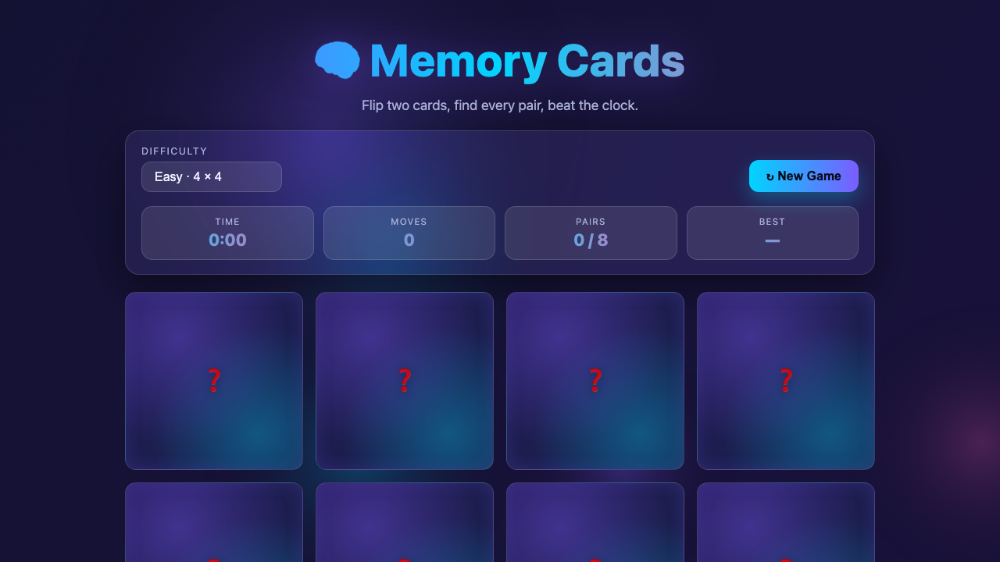

# 🧠 Memory Cards

یک بازی حافظه مدرن و بدون وابستگی، ساخته‌شده با Canvas و جاوااسکریپت خالص.

🎮 **بازی آنلاین:** https://gamelabz.github.io/html5-game-memory-cards/

## 📸 تصویر بازی



## 🎯 درباره بازی

🧠 Memory Cards نسخه‌ای مدرن و شیشه‌گون (glassmorphic) از بازی کلاسیک تمرکز است. دو کارت را هم‌زمان برگردان تا زوج‌های یکسان را پیدا کنی — زوج‌های پیدا‌شده رو باز می‌مانند و کارت‌های نامنطبق پس از لحظه‌ای دوباره برمی‌گردند. کل تخته را پاک کن تا برنده شوی و سریع‌ترین زمان را در هر سطح به دست بیا. سه اندازه تخته بازی را برای بازیکنان تازه‌کار و استادان حافظه جذاب نگه می‌دارد.

## 🕹️ کنترل‌ها

- **کلیک / لمس** روی یک کارت آن را برمی‌گرداند.
- **کلیک / لمس** روی کارت دوم، آن را نمایان می‌کند و تطبیق را می‌سنجد.
- **منوی سطح سختی** — بین آسان (۴×۴)، سخت (۶×۶) و حرفه‌ای (۸×۸) جابه‌جا شو.
- **↻ بازی جدید** — در هر زمان تخته را بُرز و دوباره شروع کن.
- **صفحه‌کلید** — کارت‌ها عناصر واقعی `<button>` هستند، پس با Tab + Enter/Space کاملاً قابل کنترل‌اند.

## ✨ ویژگی‌ها

- سه سطح سختی: ۴×۴ (۸ زوج)، ۶×۶ (۱۸ زوج)، ۸×۸ (۳۲ زوج).
- **تایمر** زنده که با اولین برگردان شروع می‌شود.
- **شمارنده حرکت** که هر زوج تلاش‌شده را می‌شمارد.
- نشانگر **پیشرفت زوج‌ها** (پیدا‌شده / کل).
- **تشخیص برد** با یک پنجره جشن که خلاصه بازی را نشان می‌دهد.
- **بهترین زمان در هر سطح** ذخیره‌شده در `localStorage` با نشانه‌ی رکورد جدید 🏆.
- **پس‌زمینه گرادیان متحرک تاریک** (دریفت کلیدفریم‌های CSS + لایه تزیینی Canvas).
- پنل‌ها و کارت‌های **گلس‌مورفیسم** با انیمیشن برگردان سه‌بعدی نرم.
- **درخش نئون** روی زوج‌های پیدا‌شده؛ نمادهای هم‌راستای ایموجی (بدون تصویر خارجی).
- کاملاً **خودکفا** — بدون فریم‌ورک، بدون CDN، بدون درخواست شبکه.

## 🚀 اجرا در محیط محلی

نصبی لازم نیست. بازی را مستقیماً در مرورگر باز کن:

```bash
# روش اول: باز کردن مستقیم فایل
open index.html

# روش دوم: سرویس با یک سرور استاتیک کوچک
npx serve .
```

سپس به نشانی چاپ‌شده مراجعه کن (پیش‌فرض `http://localhost:3000`).

## 🛠️ تکنولوژی

- HTML5 `<canvas>` (پس‌زمینه متحرک تزیینی)
- CSS3 (متغیرهای سفارشی، flexbox، گلس‌مورفیسم، تبدیل‌های سه‌بعدی)
- جاوااسکریپت خالص (ES2020، بدون فریم‌ورک)

## 🤝 مشارکت

از مشارکت استقبال می‌شود! برای همکاری:

1. مخزن را فورک کن.
2. یک شاخه جدید بساز (`git checkout -b feature/my-idea`).
3. تغییرات را کامیت کن (`git commit -m "Add my idea"`).
4. به شاخه پوش کن (`git push origin feature/my-idea`).
5. یک Pull Request باز کن.

لطفاً بازی را بدون وابستگی نگه دار و قبل از ارسال در مرورگر تستش کن.

## 📄 لایسنس

این پروژه تحت [لایسنس MIT](LICENSE) منتشر شده است — یک لایسنس نرم‌افزار آزاد و متن‌باز.

---

بیا با هم چیزی بسازیم 🚀
https://tally.so/r/q4q1L9
